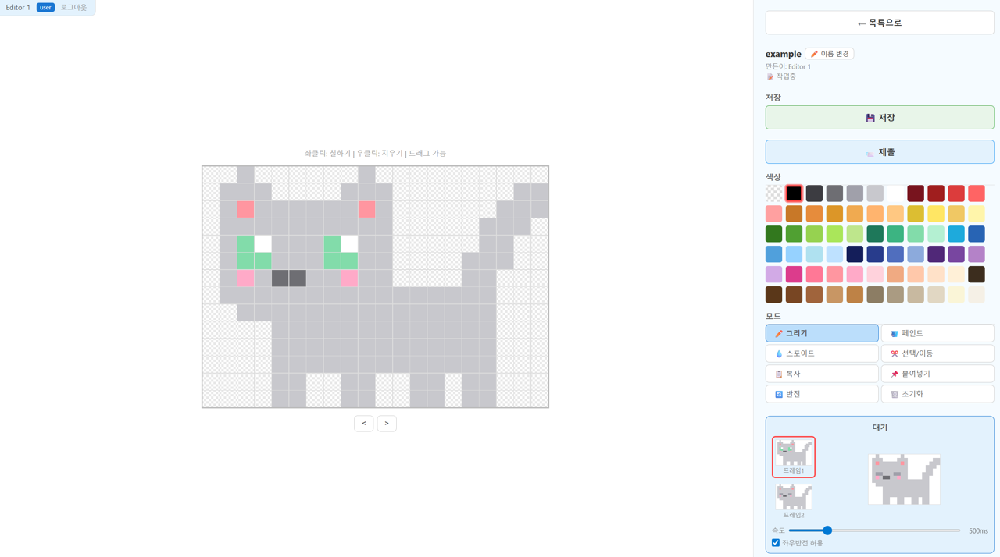

# PixelPet Studio

<p align="center">
  
</p>

A cross-platform desktop pixel pet with a web-based collaborative Studio and character approval workflow.

Design and share desktop pixel pets with your school, team, or friends — and raise them together. One person hosts the Studio, others log in to design and submit characters, and the Master approves what ships. New characters appear in every pet's character menu — no reinstall needed.

<p align="center">
  
</p>

## Overview

| Component | Role |
|-----------|------|
| **Desktop Pet** (Electron) | Transparent pixel-art pet that lives on your desktop — walks, sits, sleeps, talks |
| **Studio** | Browser-based pixel editor where multiple Editors design characters |
| **Approval Workflow** | Master reviews submissions and publishes approved characters |
| **Live Sync** | Pets fetch the latest approved characters when the character menu opens |

Runs on **Windows** and **macOS**.

## Features

### Desktop Pet
- Transparent always-on-top window (Windows, macOS)
- States: idle · walk · sit · sleep · run
- Custom dialogues per character with speech & thought bubbles
- Multi-monitor aware (drag to move across screens)
- Wanders within a local area around its home; drag to relocate
- Character selection screen with preview
- Right-click menu (feed · pet · switch character · quit)

### Studio
- 20×14 pixel grid with 65-color palette
- 8 animation frames (2 per state)
- Live animation preview with adjustable speed
- Draw, fill, pick, select / move tools
- Undo / redo, copy / paste, mirror, clear
- Keyboard shortcuts: `Ctrl+S` save, `Ctrl+Z` undo, `Ctrl+Y` redo
- Template-based character creation (start from an approved character)
- Per-character dialogue editing
- Duplicate character names blocked on create & rename
- Submit auto-saves the current edits before flipping status
- Submission & approval workflow
- User management (Master only)

## Requirements

**Studio Server (Master):**
- Python 3.10+ (standard library only — no extra install)
- [ngrok](https://ngrok.com/) (optional — for public access)
- A bash shell — macOS/Linux native; **on Windows, use [WSL](https://learn.microsoft.com/windows/wsl/install)** (the launcher scripts are bash and require `python3`)

**Desktop Pet (Users):**
- Windows 10+ or macOS 10.13+ — no install, just download the prebuilt binary

**Build from source (developers):**
- [Git](https://git-scm.com/) + [Node.js](https://nodejs.org/) 18+ (Windows: install natively and build from **PowerShell**)

## Quick Start

### 1 · Run the Studio Server (Master)

```bash
git clone https://github.com/mhlee216/pixelpet-studio.git
cd pixelpet-studio

# edit with your own settings
cp env.config.example env.config

# 1) local  2) public (ngrok)
bash run.sh
```

Keep the public server running after closing the terminal:

```bash
nohup bash serve.sh > serve.log 2>&1 &
disown
```

> **How public access works:** ngrok creates a public tunnel from `https://<NGROK_DOMAIN>` → `localhost:8000` on the Master's machine. The Python server runs locally on the Master's PC; ngrok is only the front door. **If the Master's machine sleeps, powers off, or drops off the network, the Studio goes offline** — Editors get connection errors and desktop pets can't refresh characters. Keep the machine awake (disable sleep) while Editors or Users are active, or host on an always-on server instead.

### 2 · Access the Studio (Editors)

Open the URL shared by Master in a browser — e.g.

```
https://hunger-freeware-accompany.ngrok-free.dev
```

Pick one of the slots the Master assigns you (`Master`, `Editor 1` … `Editor 10`) and enter the password the Master shared. Editor slots ship with default password `0000`; the Master resets them from the Studio's user panel.

### 3 · Install the Desktop Pet (Users)

Download the prebuilt binary — **no Git, Node, or terminal needed**.

1. Open the repo's [**Releases**](https://github.com/mhlee216/pixelpet-studio/releases) page
2. Grab the file for your OS:
   - **Windows** — `PixelPet-X.Y.Z.exe` (portable, no install; data stored next to the .exe in `.pixelpet-data/`)
   - **macOS** — `PixelPet-X.Y.Z.dmg`
3. Double-click to run. Each launch asks for the Studio URL shared by your Master, then lets you pick a character. Quit via right-click → "종료".

> **Tip:** drag the binary to your Desktop (or pin to Start Menu / Dock) for quick access — the URL prompt still appears every launch.
>
> **Slow startup (Windows)?** Move the `.exe` out of cloud-synced folders (OneDrive, Dropbox, etc.) — try `C:\Apps\` or any local-only folder. Cloud sync + Windows Defender on every launch can stretch portable extraction from ~5 seconds to ~1 minute.
>
> **macOS first launch:** unsigned `.dmg` triggers a Gatekeeper warning ("unidentified developer"). Right-click the app → Open → confirm. One-time per install.

<details>
<summary><b>Build from source (optional — for developers)</b></summary>

**Windows (PowerShell)**

```powershell
# First time only — install Node.js if not already
winget install OpenJS.NodeJS.LTS

git clone https://github.com/mhlee216/pixelpet-studio.git
cd pixelpet-studio\pixelpet

# First time only — if PowerShell blocks npm with "scripts disabled":
# Set-ExecutionPolicy -Scope CurrentUser RemoteSigned

npm install
npm run build

# bring exe up to pixelpet-studio\
copy dist\PixelPet-*.exe ..
```

**macOS (Terminal)**

```bash
# First time only — install Node.js if not already (requires Homebrew)
brew install node

git clone https://github.com/mhlee216/pixelpet-studio.git
cd pixelpet-studio/pixelpet
npm install
npm run build

# bring dmg up to pixelpet-studio/
cp dist/PixelPet-*.dmg ..
```

The binary lands at `dist/PixelPet-X.Y.Z.{exe,dmg}` (version from `pixelpet/package.json`). macOS `.dmg` must be built on macOS.

</details>

## Configuration (Master)

Copy `env.config.example` to `env.config` and fill in your own values. **`MASTER_PW` is always required**; the `NGROK_*` and `PIXELPET_SERVER` lines are only needed for public access (`bash run.sh` → option 2).

```env
MASTER_PW=your_master_password
NGROK_DOMAIN=your-domain.ngrok-free.dev
NGROK_PATH=/path/to/ngrok
PIXELPET_SERVER=https://your-domain.ngrok-free.dev
```

| Key | What to put | How to get it |
|-----|-------------|---------------|
| `MASTER_PW` | The password you'll use to log in as Master | Pick anything; keep it private |
| `NGROK_DOMAIN` | Your reserved ngrok domain (no `https://`) | [ngrok dashboard](https://dashboard.ngrok.com/domains) → "+ New Domain" (free plan: 1 static domain) |
| `NGROK_PATH` | Absolute path to the `ngrok` binary | `which ngrok` (Linux/macOS) or the install path on Windows, e.g. `C:\Users\you\AppData\Local\Microsoft\WinGet\Links\ngrok.exe`. If `ngrok` is on `$PATH`, just `ngrok` works |
| `PIXELPET_SERVER` | Same as `NGROK_DOMAIN` but with `https://` prefix | Just paste `https://` + your `NGROK_DOMAIN` |

> Local-only test (no public access): you can skip `NGROK_*` and `PIXELPET_SERVER` if you only run `bash run.sh` → option 1 (localhost).

### First-time ngrok setup

If this is your first time using ngrok:

1. Sign up at https://ngrok.com (free)
2. Install ngrok ([download](https://ngrok.com/download))
3. Register your auth token (one-time): `ngrok config add-authtoken <YOUR_TOKEN>`
4. Reserve a free static domain at https://dashboard.ngrok.com/domains, then put it into `NGROK_DOMAIN`

## Roles

| Role | Capabilities |
|------|--------------|
| **Master** | Manage users, review / approve / reject characters, edit any character, reset passwords |
| **Editor** | Create & edit own characters, submit for approval, view approved characters |
| **User** | Install and run the desktop pet; sees newly approved characters when opening the character menu |

## Workflow

```
Editor → save (draft) → submit for review
      → Master reviews / edits / approves
      → Character published to all users
```

Editors see only their own characters plus anything approved (which they can reuse as templates). Master sees everything.

## Project Structure

```
pixelpet-studio/
├── server.py         # Studio web server (Python stdlib only)
├── studio/           # Studio web UI (served by server.py)
│   ├── editor.html       # Pixel editor
│   └── login.html        # Login page
├── run.sh            # Launcher (local / ngrok)
├── serve.sh          # Public server launcher (used with nohup)
├── env.config.example  # Config template (copy to env.config)
├── images/             # Static assets used by the Studio / README
├── pixelpet/         # Desktop pet (Electron app)
│   ├── main.js         # Transparent always-on-top window
│   ├── renderer.js     # Pet logic (state machine, drag, click)
│   ├── index.html
│   ├── styles.css
│   ├── preload.js
│   ├── colors.js       # 65-color palette
│   ├── icon.ico        # App icon (Windows builds)
│   ├── .gitignore      # ignore node_modules, dist
│   ├── .npmrc          # npm audit/fund noise off
│   └── package.json
├── characters/       # Default characters bundled with the repo
├── env.config        # Local config (gitignored)
└── users.json        # User data (gitignored)
```

## Built With

[Claude Code](https://claude.ai/code) by Anthropic.

## License

MIT
